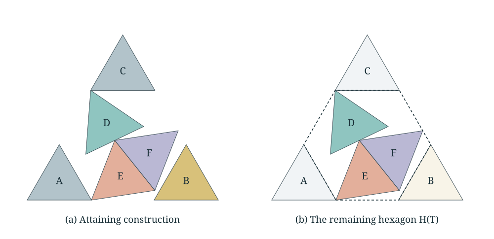

# Six equilateral triangles: an exact optimum

**A computer-assisted proof of the optimal packing of six equilateral triangles**

Kevin M. Neal · Preprint v1.0.0 · October 2026

Six unit equilateral triangles, with independently chosen rotations and legal boundary contact, fit in an equilateral container of minimum side

\[
s(6)=\frac{13+3\sqrt{13}}8=2.9770817282989959849\ldots.
\]

[Read the preprint](paper/preprint.pdf) · [Interactive explanation](https://kevinmneal.github.io/six-triangle-packing/) · [Manuscript source](paper/main.tex) · [Research process](PROCESS.md)



The construction is credited to **Maurizio Morandi, August 2008**, in [Erich Friedman's catalogue](https://erich-friedman.github.io/packing/triintri/). This work contributes the unrestricted optimality argument and exact finite certificate. A literature search did not locate an earlier published proof; it cannot establish the absence of all unpublished or unindexed work.

This is an exact **computer-assisted proof**, not a Lean formalization or a claim of external human peer-review acceptance. Its mathematical arguments are in the preprint. The finite computations are checked using exact rational and radical arithmetic. [Verification scope](docs/VERIFICATION.md) · [Prior work](docs/PRIOR_ART.md) · [AI use and attribution](ACKNOWLEDGEMENTS.md)

## Reproduce

Python 3.10 or newer, using only its standard library:

```sh
git clone https://github.com/kevinmneal/six-triangle-packing.git
cd six-triangle-packing
python3 tools/verify.py
```

Require `COMPOSED_EXACT_REVIEW_PASSED` and exit status zero. Reports go into a new `work/verification-*` directory; no certificate is overwritten. The wrapper verifies the frozen source/certificate hashes, checks the entire global cover with a separately implemented consumer, checks the embedded local packet with the earlier independent local consumer, and runs the regression tests. Both consumers run with site initialization and ordinary Python assertions disabled.

The final cover has **22,329 outer nodes, 328 local captures, and zero unresolved leaves**. The nested linear proofs contain **7,511 exact residual-aware contradictions**. The fixed-side local theorem checks **eight branches and 128 dual identities**. Counts are diagnostics: the programs reconstruct and check every relevant object rather than accepting stored counts or solver statuses.

The retained certificate is [certificates/optimality_T.json.gz](certificates/optimality_T.json.gz), SHA-256:

```text
f8b2306312064ae083d91a97bd01d1669970685d1e3c0b71b3628f2ecfc773be
```

The original production consumer is also included as a second implementation:

```sh
python3 -S -O tools/discover.py verify-production
```

It must return `OPTIMALITY_PROVED`. It has no numerical-package dependency.

## How the proof works

1. **Corner replacement.** An analytic lemma replaces at most three pieces by aligned corner triangles while retaining three original pieces unchanged in a hexagon.
2. **A complete closed cover.** The three survivors retain arbitrary independent orientations. Rational outer domains, contained triangular cores, strict overlap exclusions, and complete weak separation disjunctions cover all normalized possibilities.
3. **Local capture.** Every region not excluded lies in an explicitly bounded neighborhood of a reference core. For a feasible packing at the exact target side, the local theorem identifies a rotated or reflected reference triple. Its contacts with all three target walls contradict any smaller container.

The container-side symmetry is applied at the exact target, not at the rational search envelope. The preprint explains this distinction and the return to the original coordinate frame. The sixth piece is a rattler; isolation or uniqueness of all six original poses is not claimed.

## Reproduce discovery separately

Numerical optimization proposes proof data. Its results are not trusted for acceptance. Discovery requires Python 3.12 or newer (tested with 3.13.5). Install the optional, pinned dependencies in an isolated environment:

```sh
python3 -m venv .venv
.venv/bin/python -m pip install -r requirements-discovery.txt
.venv/bin/python tools/discover.py cover --seconds 600 --nodes 100000
```

The wrapper fixes the published side envelope, radius `1/50`, two contraction sweeps, and 24-bit outward rounding. Each run uses a new output directory. A bounded run may correctly return **UNKNOWN** with unresolved branches; that is not an optimality proof. A supplied complete certificate can be checked without rediscovering it. See [discovery documentation](discovery/README.md) for resume and exact local-dual regeneration.

To regenerate the local packet independently of global rediscovery:

```sh
.venv/bin/python tools/discover.py local-duals
```

The published local coefficients were reproduced byte for byte during release preparation. Exact acceptance remains separate from the floating-point proposal stage.

## Manuscript and website

[paper/main.tex](paper/main.tex) is a standalone LaTeX source; the PDF and vector figures are included. With [Tectonic](https://tectonic-typesetting.github.io/) installed:

```sh
python3 tools/build_paper.py
```

The geometry figures can be regenerated with `python3 tools/make_figures.py`, using the checked exact reference before rounding display coordinates.

The buildless website lives in `site/`. Preview it with:

```sh
python3 -m http.server 8000 --directory site
```

Open `http://localhost:8000`. Its browser check verifies the explicit construction only; it does not replace the global proof. The visual diagram uses rounded coordinates. No tracker, remote font, framework, or account is required.

## Repository map

| Path | Purpose |
|---|---|
| `paper/` | Preprint source, PDF, references, and vector figures |
| `certificates/` | Frozen completed proof packet |
| `verification/` | Separately implemented consumers, source hashes, release evidence |
| `discovery/` | Optional numerical producer and original production consumer |
| `tests/` | Reviewed geometry and corruption tests, plus packaging regressions |
| `site/` | Interactive explanation and browser construction check |
| `docs/` | Verification scope, literature audit, and formalization roadmap |
| `PROCESS.md` | Concise research history, including unsuccessful approaches |
| `PROVENANCE.md` | Source lineage and scope of the curated release |

The full exploratory archive remains separate. Nothing outside this public repository is needed to read the proof, replay its finite premises, or run the documented discovery tools.

## Citation and reuse

Copy this citation for the current preprint:

```text
Neal, K. M. (2026). A computer-assisted proof of the optimal packing of six equilateral triangles (Version 1.0.0) [Preprint]. https://github.com/kevinmneal/six-triangle-packing/releases/tag/v1.0.0
```

Or use BibTeX:

```bibtex
@misc{neal2026sixtriangles,
  author = {Neal, Kevin M.},
  title  = {A computer-assisted proof of the optimal packing of six equilateral triangles},
  year   = {2026},
  note   = {Preprint, version 1.0.0},
  url    = {https://github.com/kevinmneal/six-triangle-packing/releases/tag/v1.0.0}
}
```

[CITATION.cff](CITATION.cff) provides the same citation in a machine-readable format. These citations identify the archived v1.0.0 paper and certificate; routine documentation or demo changes do not change that version. Update both examples and `CITATION.cff` when a new preprint version is released. No DOI or arXiv identifier is asserted unless one is actually assigned.

Code is provided under MIT; original manuscript text, figures, and proof data under CC BY 4.0. See [LICENSE.md](LICENSE.md). Prior constructions and cited external works retain their own attribution and rights.
